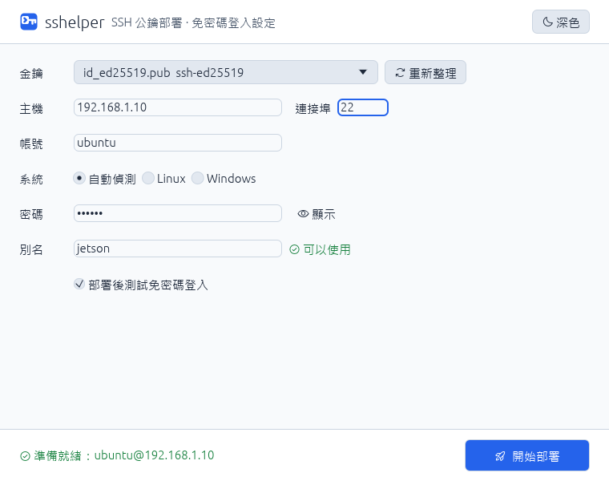
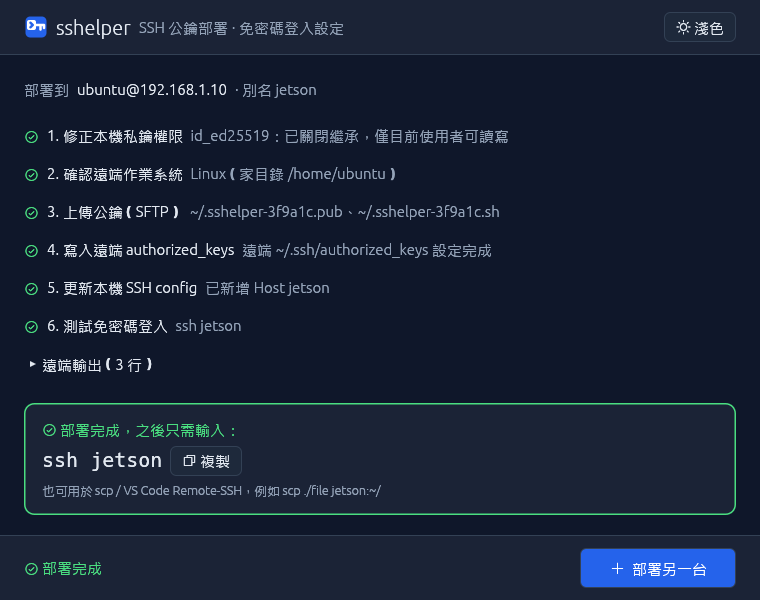
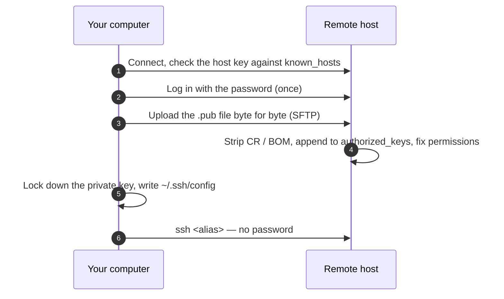

<div align="center">


# sshelper

**Passwordless SSH in one step.**<br>
Deploy your public key to a server, get a ready-to-use `ssh <alias>`.

[](https://github.com/yeeN1234/sshelper/actions/workflows/ci.yml)
[](https://github.com/yeeN1234/sshelper/releases)


[](LICENSE)

**English** · [繁體中文](README.zh-TW.md)

 

</div>

---

Setting up key-based SSH by hand means generating a key, copying it over, fixing permissions on both ends and editing `~/.ssh/config` — and on Windows, a PowerShell pipeline can silently add a BOM or CRLF that makes the server reject the key. **sshelper does all of it from one form**, then checks that the login really works.

## Features

- **One window, one button** — pick a key, enter host / user / password, choose an alias, deploy.
- **GUI and CLI** — `sshelper-gui` for clicking, `sshelper` for terminals and scripts (fully unattended mode included).
- **Linux and Windows targets** — Windows admins get `administrators_authorized_keys` handled too.
- **Safe by default** — host fingerprints are confirmed and recorded in `known_hosts`, passwords are never stored, `~/.ssh/config` is backed up before every change.
- **No system `ssh` / `scp` needed** — a pure-Rust SSH client ([russh](https://github.com/Eugeny/russh)); you type the password once.
- **Verified** — ends with a real `ssh <alias>` login test.

## Install

Grab the latest build from [**Releases**](https://github.com/yeeN1234/sshelper/releases):

| Platform | File | How |
| --- | --- | --- |
| Windows | `sshelper-gui-<version>-windows-x64.exe` | Double-click. Nothing to install. |
| Windows | `sshelper-<version>-windows-x64.zip` | Unzip. GUI and CLI. |
| Ubuntu / Debian | `sshelper_<version>_amd64.deb` | `sudo apt install ./sshelper_<version>_amd64.deb` — then find *sshelper* in your app menu, or run `sshelper`. |
| Other Linux | `sshelper-<version>-linux-x64.tar.gz` | Unpack and run `./sshelper-gui` or `./sshelper`. |

> Linux builds need glibc 2.35+ (Ubuntu 22.04, Debian 12 or newer). macOS: build from source for now.

## Usage

### GUI

1. **Key** — pick a public key from `~/.ssh` (the private key next to it is used automatically).
2. **Host** — IP or domain (`user@host` works too), port, user (default `ubuntu`), OS (auto-detect is fine).
3. **Password** — used for this one login only, never saved.
4. **Alias** — the name you will type, e.g. `jetson`. Existing aliases are flagged and can be replaced.
5. Press **Deploy** (or Enter). Confirm the host fingerprint on first contact — then just run `ssh jetson`.

Light / dark theme is in the top-right corner.

### CLI

```sh
sshelper                                  # interactive wizard
sshelper -H 192.168.1.10 -a jetson        # only asks for what is missing
sshelper keys                             # list keys in ~/.ssh
```

Unattended, e.g. in a script or CI:

```sh
echo "$PASSWORD" | sshelper -k id_ed25519 -H ubuntu@10.0.0.5 -a dev \
    --accept-new-host-key --password-stdin
```

<details>
<summary><b>All options</b></summary>

| Option | Meaning |
| --- | --- |
| `-k, --key` | Key name in `~/.ssh` (`id_ed25519`) or a file path |
| `-H, --host` | Target host, `user@host` allowed |
| `-u, --user` / `-p, --port` | User (default `ubuntu`) / port (default 22) |
| `--os auto\|linux\|windows` | Target OS (default: auto-detect) |
| `-a, --alias` | `Host` name in `~/.ssh/config` |
| `--replace` | Overwrite an existing `Host <alias>` section |
| `--accept-new-host-key` | Trust an unknown host key (a *changed* key is still refused) |
| `--password-stdin` | Read the password from stdin (or set `SSHELPER_PASSWORD`) |
| `--no-verify` / `-y` | Skip the login test / skip the confirmation |
| `--ssh-dir` | Use another `.ssh` directory (also `SSHELPER_SSH_DIR`, GUI included) |

Exit codes: `0` success · `1` failure · `3` deployed but the login test failed · `130` cancelled.

</details>

## How it works



<details>
<summary><b>Details per step</b></summary>

- **Private key permissions** — Windows: `icacls` removes inheritance and grants only the current user (avoids `UNPROTECTED PRIVATE KEY FILE`); Unix: `chmod 600`.
- **Linux targets** — `~/.ssh` 700, `authorized_keys` 600, duplicates skipped, a missing final newline fixed, SELinux contexts restored.
- **Windows targets** — writes `%USERPROFILE%\.ssh\authorized_keys` and, for administrators, `%ProgramData%\ssh\administrators_authorized_keys`, as UTF-8 without BOM, with the ACLs sshd expects.
- **`~/.ssh/config`** — the entry goes *before* any `Host *` block (ssh uses the first value it reads), an existing alias is replaced in place, BOM / UTF-16 files are converted back to UTF-8, and a `config.bak-<time>` backup is kept.
- **Why upload a file instead of piping text?** PowerShell pipelines may re-encode text to UTF-16, add a UTF-8 BOM or turn LF into CRLF — each makes sshd ignore the key. The file goes up untouched and is cleaned on the server.

</details>

## Troubleshooting

<details>
<summary><b>Host key changed</b></summary>

The server was reinstalled or its keys were rotated. Once you are sure it is the right machine, remove the old record and deploy again: `ssh-keygen -R <host>` (`ssh-keygen -R "[host]:port"` for non-22 ports).
</details>

<details>
<summary><b>The server does not accept passwords</b></summary>

sshelper needs one password login to install the key. Enable `PasswordAuthentication` temporarily, or add the key from the console.
</details>

<details>
<summary><b>The login test failed</b></summary>

Common causes: the private key has a passphrase (use `ssh-agent`), or the Linux home directory is group/world-writable (`chmod go-w ~`). Run `ssh -v <alias>` for the details.
</details>

<details>
<summary><b>Chinese text shows as boxes on Linux</b></summary>

Install a CJK font (`sudo apt install fonts-noto-cjk`) or point `SSHELPER_FONT` at any `.ttf` / `.ttc` file.
</details>

## Development

```sh
cargo build --release      # target/release/sshelper(.exe) and sshelper-gui(.exe)
cargo test --workspace
```

Linux needs `libxkbcommon-dev libgtk-3-dev libxcb-render0-dev libxcb-shape0-dev libxcb-xfixes0-dev` to build the GUI. On Windows the icon is embedded with `rc.exe` from the Windows SDK (included with Visual Studio Build Tools).

<details>
<summary><b>Project layout</b></summary>

```
crates/
  sshelper-core/   library: keys, ~/.ssh/config editing, SSH (russh + SFTP), deployment, verification
  sshelper-cli/    `sshelper` — clap + inquire
  sshelper-gui/    `sshelper-gui` — eframe / egui
assets/icon/       app icon (SVG, PNG, .ico, .icns)
assets/linux/      .desktop entry
```
</details>

<details>
<summary><b>End-to-end tests against a throwaway SSH server</b></summary>

```sh
docker run -d --rm --name sshelper-e2e -p 127.0.0.1:2222:2222 \
  -e PUID=1000 -e PGID=1000 -e PASSWORD_ACCESS=true \
  -e USER_NAME=tester -e USER_PASSWORD=sshelper-test \
  lscr.io/linuxserver/openssh-server:latest

# full deployment through the GUI (egui_kittest)
SSHELPER_E2E_TARGET=tester@127.0.0.1 SSHELPER_E2E_PORT=2222 SSHELPER_E2E_PASSWORD=sshelper-test \
  cargo test -p sshelper-gui -- --ignored

docker stop sshelper-e2e
```
</details>

<details>
<summary><b>Releasing</b></summary>

1. Bump `version` in `Cargo.toml` and commit.
2. Push a matching tag: `git tag v0.2.0 && git push origin v0.2.0`.
3. `.github/workflows/release.yml` builds Windows and Linux packages and publishes the Release.
</details>

## License

[MIT](LICENSE). The app icon in `assets/icon/` is MIT as well ([assets/icon/LICENSE](assets/icon/LICENSE)).
