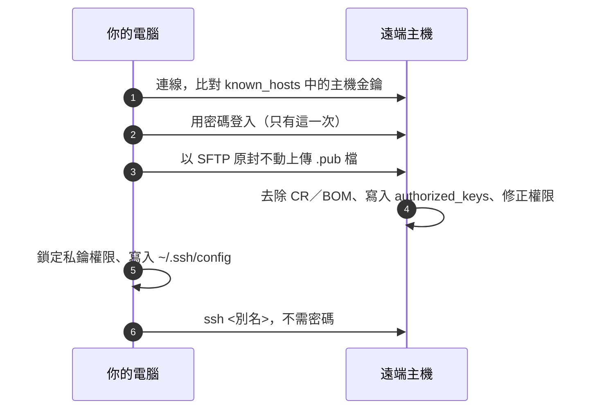

<div align="center">


# sshelper

**一步完成 SSH 免密碼登入。**<br>
把公鑰部署到遠端主機，之後只要輸入 `ssh <別名>` 就能登入。

[](https://github.com/yeeN1234/sshelper/actions/workflows/ci.yml)
[](https://github.com/yeeN1234/sshelper/releases)


[](LICENSE)

[English](README.md) · **繁體中文**

 

</div>

---

手動設定 SSH 免密碼登入，要產生金鑰、複製公鑰、修正兩邊的權限、再編輯 `~/.ssh/config`。在 Windows 上，PowerShell 的文字管線還可能偷偷加上 BOM 或 CRLF，讓伺服器拒絕這把金鑰。**sshelper 用一張表單完成全部步驟**，最後實際登入一次，確認真的不用密碼。

## 特色

- **一個視窗、一個按鈕**：選金鑰、填主機／帳號／密碼、取別名，按下部署。
- **圖形介面與命令列**：`sshelper-gui` 用滑鼠操作；`sshelper` 給終端機與腳本使用，也支援完全無人值守。
- **支援 Linux 與 Windows 主機**：Windows 管理員帳號需要的 `administrators_authorized_keys` 也一併處理。
- **預設就安全**：首次連線會確認主機指紋並記錄到 `known_hosts`；不儲存密碼；修改 `~/.ssh/config` 前一定先備份。
- **不需要系統的 `ssh`／`scp`**：內建純 Rust 的 SSH 用戶端（[russh](https://github.com/Eugeny/russh)），密碼只要輸入一次。
- **自動驗證**：最後實際執行一次 `ssh <別名>` 登入測試。

## 下載安裝

到 [**Releases**](https://github.com/yeeN1234/sshelper/releases) 下載最新版：

| 平台 | 檔案 | 安裝方式 |
| --- | --- | --- |
| Windows | `sshelper-gui-<版本>-windows-x64.exe` | 直接雙擊執行，不需安裝 |
| Windows | `sshelper-<版本>-windows-x64.zip` | 解壓縮；內含圖形介面與命令列版 |
| Ubuntu / Debian | `sshelper_<版本>_amd64.deb` | `sudo apt install ./sshelper_<版本>_amd64.deb`，之後從應用程式選單開啟，或在終端機輸入 `sshelper` |
| 其他 Linux | `sshelper-<版本>-linux-x64.tar.gz` | 解壓縮後執行 `./sshelper-gui` 或 `./sshelper` |

> Linux 版需要 glibc 2.35 以上（Ubuntu 22.04、Debian 12 或更新版本）。macOS 目前請自行從原始碼編譯。

## 使用方式

### 圖形介面

1. **金鑰**：選擇 `~/.ssh` 中的公鑰，旁邊同名的私鑰會自動對應。
2. **主機**：IP 或網域（也可以直接輸入 `user@host`）、連接埠、帳號（預設 `ubuntu`）、作業系統（選自動偵測即可）。
3. **密碼**：只用於這一次登入，不會儲存。
4. **別名**：之後要輸入的名字，例如 `jetson`。別名已存在時會提示，可以選擇覆蓋。
5. 按下 **開始部署**（或按 Enter）。第一次連線時確認主機指紋，完成後輸入 `ssh jetson` 即可登入。

右上角可以切換淺色／深色主題。

### 命令列

```sh
sshelper                                  # 互動式精靈
sshelper -H 192.168.1.10 -a jetson        # 只詢問缺少的項目
sshelper keys                             # 列出 ~/.ssh 中的金鑰
```

無人值守（腳本或 CI）：

```sh
echo "$PASSWORD" | sshelper -k id_ed25519 -H ubuntu@10.0.0.5 -a dev \
    --accept-new-host-key --password-stdin
```

<details>
<summary><b>所有選項</b></summary>

| 選項 | 說明 |
| --- | --- |
| `-k, --key` | `~/.ssh` 中的金鑰名稱（例如 `id_ed25519`）或檔案路徑 |
| `-H, --host` | 目標主機，可寫成 `user@host` |
| `-u, --user` / `-p, --port` | 帳號（預設 `ubuntu`）／連接埠（預設 22） |
| `--os auto\|linux\|windows` | 目標作業系統（預設自動偵測） |
| `-a, --alias` | `~/.ssh/config` 的 `Host` 名稱 |
| `--replace` | 覆蓋已存在的同名 `Host` 區塊 |
| `--accept-new-host-key` | 自動信任尚未記錄的主機金鑰（金鑰「變更」時仍會拒絕） |
| `--password-stdin` | 從標準輸入讀取密碼（或用環境變數 `SSHELPER_PASSWORD`） |
| `--no-verify` / `-y` | 不測試登入／略過確認 |
| `--ssh-dir` | 改用其他 `.ssh` 目錄（環境變數 `SSHELPER_SSH_DIR`，圖形介面也適用） |

結束代碼：`0` 成功 · `1` 失敗 · `3` 已部署但登入測試未通過 · `130` 已取消。

</details>

## 運作方式



<details>
<summary><b>各步驟細節</b></summary>

- **私鑰權限**：Windows 以 `icacls` 關閉繼承、只授權目前使用者，避免 `UNPROTECTED PRIVATE KEY FILE`；Unix 為 `chmod 600`。
- **Linux 主機**：`~/.ssh` 設為 700、`authorized_keys` 設為 600；已存在的金鑰不重複加入；補上缺少的結尾換行；SELinux 環境會還原安全標籤。
- **Windows 主機**：寫入 `%USERPROFILE%\.ssh\authorized_keys`，管理員帳號另外寫入 `%ProgramData%\ssh\administrators_authorized_keys`。一律存成無 BOM 的 UTF-8，並設定 sshd 要求的權限。
- **`~/.ssh/config`**：新設定放在 `Host *` 區塊之前（ssh 採用最先讀到的值）；同名別名原地覆蓋；BOM／UTF-16 編碼的檔案轉回 UTF-8；修改前保留 `config.bak-<時間>` 備份。
- **為什麼上傳檔案，而不是用管線傳文字？** PowerShell 管線可能把文字轉成 UTF-16、加上 UTF-8 BOM，或把 LF 換成 CRLF，任何一種都會讓 sshd 忽略這把金鑰。所以檔案原封不動上傳，再由伺服器端清理。

</details>

## 常見問題

<details>
<summary><b>主機金鑰不符</b></summary>

代表主機重灌過或更換了金鑰。確認是同一台機器後，先移除舊紀錄再重新部署：`ssh-keygen -R <host>`（非 22 port 為 `ssh-keygen -R "[host]:port"`）。
</details>

<details>
<summary><b>伺服器不接受密碼登入</b></summary>

sshelper 需要用密碼登入一次才能放入金鑰。請暫時開啟 `PasswordAuthentication`，或改從主控台加入金鑰。
</details>

<details>
<summary><b>免密碼登入測試未通過</b></summary>

常見原因：私鑰設有 passphrase（請搭配 `ssh-agent`），或 Linux 家目錄可被群組／他人寫入（執行 `chmod go-w ~`）。可用 `ssh -v <別名>` 查看詳細過程。
</details>

<details>
<summary><b>Linux 上中文顯示成方塊</b></summary>

安裝中文字型（`sudo apt install fonts-noto-cjk`），或用環境變數 `SSHELPER_FONT` 指向任一 `.ttf`／`.ttc` 字型檔。
</details>

## 開發

```sh
cargo build --release      # 產出 target/release/sshelper(.exe) 與 sshelper-gui(.exe)
cargo test --workspace
```

Linux 編譯圖形介面需要先安裝 `libxkbcommon-dev libgtk-3-dev libxcb-render0-dev libxcb-shape0-dev libxcb-xfixes0-dev`。Windows 會用 Windows SDK 的 `rc.exe` 把圖示嵌入執行檔（安裝 Visual Studio Build Tools 時已附）。

<details>
<summary><b>專案結構</b></summary>

```
crates/
  sshelper-core/   核心函式庫：金鑰、~/.ssh/config、SSH（russh + SFTP）、部署、驗證
  sshelper-cli/    `sshelper`：clap + inquire
  sshelper-gui/    `sshelper-gui`：eframe / egui
assets/icon/       應用程式圖示（SVG、PNG、.ico、.icns）
assets/linux/      Linux 應用程式選單捷徑（.desktop）
```
</details>

<details>
<summary><b>用拋棄式 SSH 伺服器做端對端測試</b></summary>

```sh
docker run -d --rm --name sshelper-e2e -p 127.0.0.1:2222:2222 \
  -e PUID=1000 -e PGID=1000 -e PASSWORD_ACCESS=true \
  -e USER_NAME=tester -e USER_PASSWORD=sshelper-test \
  lscr.io/linuxserver/openssh-server:latest

# 透過圖形介面跑完整部署（egui_kittest）
SSHELPER_E2E_TARGET=tester@127.0.0.1 SSHELPER_E2E_PORT=2222 SSHELPER_E2E_PASSWORD=sshelper-test \
  cargo test -p sshelper-gui -- --ignored

docker stop sshelper-e2e
```
</details>

<details>
<summary><b>發佈新版本</b></summary>

1. 修改 `Cargo.toml` 的 `version` 並提交。
2. 推上對應的 tag：`git tag v0.2.0 && git push origin v0.2.0`。
3. `.github/workflows/release.yml` 會自動編譯 Windows 與 Linux 版，並建立 Release。
</details>

## 授權

[MIT](LICENSE)。`assets/icon/` 中的應用程式圖示同為 MIT（[assets/icon/LICENSE](assets/icon/LICENSE)）。
